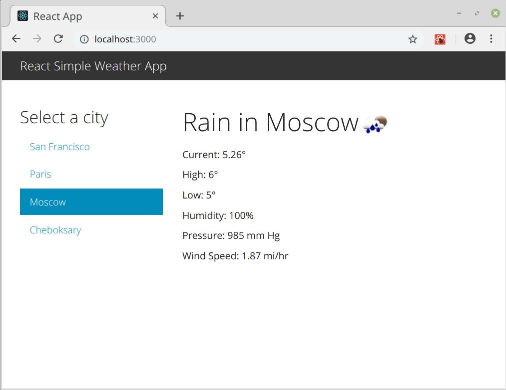

# Intro To The Project
This project was build using [React.js](https://github.com/facebook/create-react-app).

The final, working app should look like this:



## Table of Contents

- [How to create React.js App](#how-to-create-react.js-app)
- [React Components](#react-components)
- [Installing Components](#installing-components)


# How to create React.js App

First of all, you might need [Node.js](https://nodejs.org/en/) to run a local server, and a JavaScript editor like [Atom](https://atom.io/), or [Sublime Text 3](https://www.sublimetext.com/).

After all installations, open a terminal and install`create-react-app`:

```sh
(sudo) npm install -g create-react-app
```
After successfull installation, it's time to create an app itself:

```sh
create-react-app weather
```

When the folder will be created and necessary files are added, run this in order to start an app on local server:

```sh
cd weather
npm start
```
The application will be working on local server woth port -3000 by default:
```localhost:3000
```
# React Components
Basically we've got 2 main React Components/classes - WeatherDisplay and App.
Our components have 2 basic and vital functions:
- constructor()
  Constructor helps us to initialize an initial state of the component.
- render()
  Render actually 'renders' a component and represents it in HTML page.
  
That's how sample component looks like(using ES6 standart):

```js
class WeatherDisplay extends Component {
  constructor(){
  super();
  this.state = { WeatherData: null };
  }
  render() {
    return (
      <h1>Display weather in San Francisco</h1>
    );
  }
}
```

To actually represent weather data we will use an array of JS objects with params name and zip-code.

```js
const Places = [
  { name: "San Francisco", zip: "94102" },
  { name: "Paris", zip: "75004" },
  { name: "Moscow", zip: "123423" },
  { name: "Cheboksary", zip: "428034" }
];
```
By using [OpenWeatherMap site](https://openweathermap.org/) and its API to parse JSON data about weather in some city, or region, defined by zip-code, we can actually represent the weather data

# Installing Components

Our app is still somewhat ugly. We can fix that by adding `className` props to our divs, and importing some CSS.

Or, we can install a library from `npm` that will help.

[Bootstrap](http://getbootstrap.com/) is popular UI toolkit for HTML and CSS. Let's install it, alongside `react-bootstrap` which provides the React components for it:

```sh
npm install --save bootstrap@3.3.7 react-bootstrap
```

To make some changes in UI, import the css from the bootstrap module:

```js
import "bootstrap/dist/css/bootstrap.css";
```

Next, we will import the components from `react-bootstrap`. Different components on the [react-bootstrap site](https://react-bootstrap.github.io/components.html) site.

```js
import { Navbar, NavItem, Nav, Grid, Row, Col } from "react-bootstrap";
```
Let's use some external custom theme in this project. For instance, 'bootstwatch' themes & components. To install, run:

```sh
npm install --save bootswatch@3.3.7
```

[Bootswatch website](http://bootswatch.com/). You can find some themes there, and replace the default bootstrap css with the following. I will use 'yeti' theme.

```js
import "bootswatch/yeti/bootstrap.css";
```
